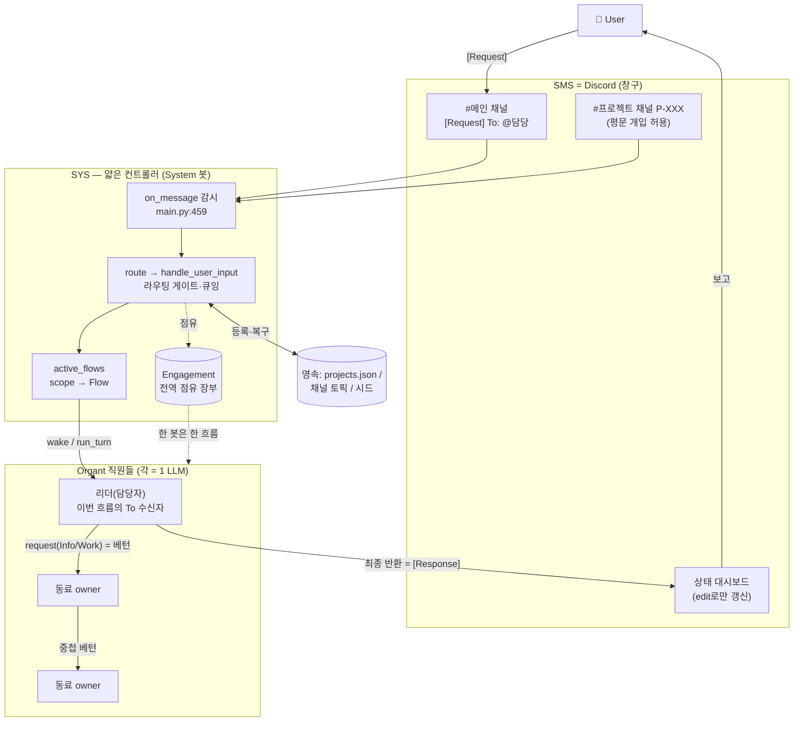

# 01 · 개요 — 시스템 컨텍스트와 멘탈 모델

## 1.1 한 문장 정의

**Organt Core**는 Discord 채널 위에서, 인격을 가진 여러 AI 직원(Organt, 각자 하나의 LLM)이 **한 번에 한 명만 활성**인 '베턴' 규칙으로 협업해 사용자의 `[Request]`를 처리하고 `[Response]`로 보고하는 시스템이다. `src/main.py:3-7`

## 1.2 4-액터 모델

```
User  ↔  SMS(Discord)  ↔  SYS  ↔  Organt(들)
```

| 액터 | 정체 | 책임 | 근거 |
|------|------|------|------|
| **User** | 사람 | 채널에 `[Request] To: @담당`을 올리고 `[Response]`를 받음 | `README.md`, `src/main.py:459-519` |
| **SMS** | Discord | 사람과 Organt가 만나는 창구(채널·스레드). 구조화 메시지만 오감 | `src/protocol.py:1-11` |
| **SYS** | 얇은 컨트롤러(System 봇) | 채널 감시 → 담당 깨우기 + **단일흐름 lock** + 라우팅. 베턴·권한은 Rule/Hook에 위임 | `src/sys_core.py:1-8` |
| **Organt** | LLM 직원(claude-agent-sdk) | `request`로 동료를 부르고 파일 도구로 직접 일함. 반환값이 곧 응답 | `src/organt.py:123-124`, `src/guide_tools.py` |

> **핵심 설계 명제**: "SYS는 얇다". 판단·작업은 전부 Organt(LLM)가 하고, SYS는 **흐름 제어(누가 언제 깨어나는가)**만 강제한다. `src/sys_core.py:7-8`

## 1.3 시스템 컨텍스트 다이어그램

<!-- 소스: diagrams/01-context.mmd -->


## 1.4 멘탈 모델 — "한 회사의 직원들"

이 시스템은 추상적인 멀티에이전트 프레임워크가 아니라 **현실의 회사**를 은유로 삼는다. 이 은유가 거의 모든 설계 결정의 근거다:

- **단일 활성(베턴)** = "한 사람은 한 번에 한 회의에만." 토큰 절약 + 사이드이펙트 감소. `src/communication.py:97-103`
- **전역 점유 장부(Engagement)** = "한 직원은 한 시점에 한 흐름에만 참여." 병렬 흐름 간 안전을 *숫자 상한*이 아니라 **점유의 배타성**으로 보장. `src/communication.py:46-49`, `src/sys_core.py:69-77`
- **직군 = Discord 역할, 이름 = 닉네임**: 직군(백엔드·QA 등)은 권한처럼 역할로, 정체성(사람 이름)은 닉네임으로 — 둘 다 서버에 영속돼 재시작·리클레임을 견딘다. `src/main.py:68-89`, `src/main.py:339-366`
- **리더 ≠ 권력자**: '담당자'는 고정 직책이 아니라 *이번 흐름의 `To` 수신자*. 다른 흐름에선 같은 봇이 한 직원으로 참여. `src/sys_core.py:1076-1079`
- **학습 플라이휠**: 각 직군 전문가가 '직무 기준'을 스스로 쓰고(`role_profiles`), 경험을 쌓고, **수면(증류)** 때 압축한다 — 시스템이 정답을 정하지 않음. `src/sys_core.py:872-914`, `src/sys_core.py:1265-1332`

## 1.5 기술 스택

| 영역 | 선택 | 근거 |
|------|------|------|
| 언어 | Python 3.11+ | `README.md`, `requirements.txt` |
| LLM 구동 | `claude-agent-sdk`의 `ClaudeSDKClient` (번들 Claude Code CLI) | `src/organt.py:17-23` |
| 메신저 | `discord.py` (`discord.Client`, 게이트웨이 인텐트) | `src/main.py:21`, `src/main.py:186-209` |
| 동시성 | `asyncio` 단일 이벤트루프 (게이트~점유 사이 `await` 없음 = 레이스 차단) | `src/sys_core.py:1834-1842` |
| 영속 | JSON 파일(원자적 쓰기) + Discord 채널 토픽/역할/닉네임 | `src/sys_core.py:138-157` |
| 배포(옵션) | GitHub push → Render (Node 웹) | `src/deploy.py`, `src/sys_core.py:1630-1671` |
| 감사 | JSONL append + journald(stderr) | `src/audit.py`, `src/sys_core.py:786-801` |

## 1.6 용어집

| 용어 | 정의 | 근거 |
|------|------|------|
| **베턴(baton)** | 단일 활성 토큰. `request` 시 sender sleep / receiver wake, 응답은 LIFO close | `src/communication.py:97-103` |
| **Flow** | 한 `[Request]`이 여는 하나의 작업 흐름(스코프 단위). `active_flows[scope]`로 추적 | `src/sys_core.py:75`, `src/guide_tools.py` |
| **scope(스코프)** | 흐름 식별자. 등록 프로젝트면 `P-XXX`, 신규면 `new-<ts>` | `src/sys_core.py:1762` |
| **Engagement** | 봇→스코프 점유 장부. 흐름 간 배타성(한 봇 한 흐름)을 보장 | `src/communication.py:46-85` |
| **Frame** | 열린 요청 한 건(요청 스택의 프레임): from/to/kind/body | `src/communication.py:87-95` |
| **리더(leader/담당자)** | 이번 흐름의 `To` 수신자. 흐름을 열고 최종 보고 | `src/sys_core.py:1055-1079` |
| **owner** | `request(Work)`를 받아 그 산출물을 끝까지 책임지는 동료 | `src/sys_core.py:1138-1141` |
| **Task** | 산출물 단위. 상태블록(`[Task-XXX]`)으로 채널에 가시화 | `src/protocol.py:42-78` |
| **개입(intervention)** | 등록 프로젝트 채널에서 이어지는 작업(세션·팀·owner 유지) | `src/sys_core.py:1757-1801` |
| **졸업(graduation)** | 메인 채널 원요청이 등록 프로젝트가 됨 → 복구가 재발사 대신 개입으로 이음 | `src/main.py:105-115`, `src/sys_core.py:195-204` |
| **증류(distillation)** | '수면' 중 경험을 직무 기준으로 압축 | `src/sys_core.py:1265-1332` |
| **리클레임 내구성** | 컨테이너 회수로 디스크가 사라져도 Discord(역할·닉·토픽)에서 복원 | `README.md`, `src/sys_core.py:320-365` |

## 1.7 이 시스템을 이해하는 3가지 키

1. **"항상 1명만 활성"** 이 불변식이 통신·점유·복구·세션 분리 전반을 지배한다 → [03 제어 흐름](03-control-flow.md).
2. **"디스크는 사라질 수 있다"** 컨테이너 리클레임 가정 위에서 모든 상태가 3중(디스크>토픽>시드)으로 영속·복원된다 → [04 상태·영속·복구](04-state-persistence-recovery.md).
3. **"SYS는 사실을 들고, LLM은 판단한다"** 프롬프트로 유도하던 동작을 점점 *구조(게이트·자동 이어가기/위임/조율)*로 옮긴 흔적이 코드 전반에 있다 → [06 패턴·컨벤션](06-patterns-conventions.md).
