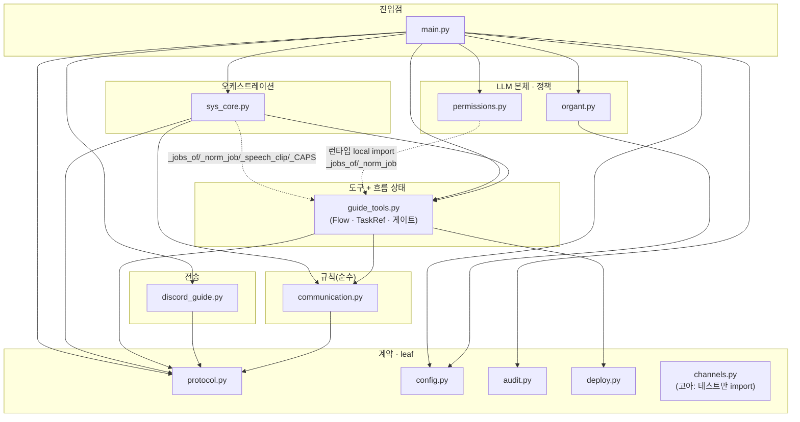

# 02 · 모듈 맵 — 책임 · 공개 API · 의존성

`src/`의 13개 모듈(~8.5K LOC)을 책임·공개 API·내부 의존성으로 정리한다. 라인 수는 분석 시점 기준이다.

## 2.1 모듈 일람

| 모듈 | LOC | 계층 | 책임 | 주요 공개 API | 근거 |
|------|----:|------|------|---------------|------|
| `protocol.py` | 131 | 계약 | Discord 구조화 메시지 계약(인코딩/파싱 + 도메인 타입) | `Kind` · `Request`/`Response`/`TaskStatus` · `parse` · `format_*` | `src/protocol.py:17-78` |
| `config.py` | 64 | 계약 | 환경변수 → frozen `Config` 로딩, `ROOT` | `Config` · `load_config` · `ROOT` | `src/config.py:10-52` |
| `audit.py` | 50 | 계약 | append-only JSONL 기록 + PostToolUse 훅 | `AuditLog` · `make_post_tool_use_hook` | `src/audit.py:10-50` |
| `deploy.py` | 367 | 계약/I-O | GitHub push → Render 배포(슬롯 풀·라이브 URL·자산 검증) | `deploy_sync` | `src/deploy.py:245` |
| `channels.py` | 69 | 계약 | 채널 선택 순수 함수 | `choose_text_channel_id` · `resolve_channel_id` | `src/channels.py:16` |
| `communication.py` | 349 | 규칙(순수) | 단일흐름 베턴 상태머신 + 전역 점유 장부 | `CommunicationManager` · `Engagement` · `Frame` · `CommError`류 | `src/communication.py:97-349` |
| `discord_guide.py` | 493 | 전송 | 통신 Rule의 Discord 구현(전송·조회·정체성/HR) | `DiscordGuide`(+`post`/`read_thread`/`set_nick`/`set_channel_topic`/`typing`…) | `src/discord_guide.py:266` |
| `guide_tools.py` | 3016 | 도구+상태 | Organt 도구셋 + `Flow`/`TaskRef` 상태 + 협업/품질 게이트 | `make_guide_tools` · `build_guide_server` · `Flow` · `TaskRef` · `deploy_service_name` · `FLOW/COORD/LEADER_TOOLS` | `src/guide_tools.py:541-3015` |
| `organt.py` | 292 | LLM 본체 | claude-agent-sdk로 Organt 구동, 세션 resume, 재시도 | `Organt` · `build_options` · `load_persona` · `pinned_cwd` | `src/organt.py:98-292` |
| `permissions.py` | 500 | 정책 훅 | PreToolUse 10-게이트(허용·샌드박스·협업 강제) | `make_pre_tool_use_hook` · `organt_allowed_tools` | `src/permissions.py:83-501` |
| `sys_core.py` | 2334 | 오케스트레이션 | SYS: 깨우기·단일흐름 lock·라우팅·흐름 수명·영속·복구·배포 | `Sys`(+`handle_user_input`/`run_turn`/`route_channel_request`/`reconcile_*`…) | `src/sys_core.py:37` |
| `main.py` | 775 | 진입점 | 봇 연결·정체성 배정·부팅 복구·시그널·카나리아·핫리로드·수면 | `run` · `main` · `load_roster` · `find_pending_request` 등 순수 함수 | `src/main.py:282` |
| `__init__.py` | 13 | 패키지 | 패키지 docstring(모듈 요약) | — | `src/__init__.py` |

## 2.2 내부 의존성 그래프

<!-- 소스: diagrams/02-dependency-graph.mmd -->

## 2.3 계층 해석

의도된 계층은 **계약 < 규칙 < 전송 < 도구/상태 < 오케스트레이션 < 진입점**이며, 대체로 잘 지켜진다:

- ✅ **순수 규칙의 격리**: `communication.py`(베턴 로직)는 `protocol`만 의존하고 네트워크·IO가 없다 — 단위 테스트 용이. `src/communication.py:1`, `dependsOnInternal=[protocol]`
- ✅ **진입점이 배선 책임 집중**: `main.py`가 거의 모든 모듈을 조립(의존성 주입: `organt_builder`를 `Sys`에 주입). `src/main.py:379-384`

### 🏗️/⚠️ 계층 관찰

- 🏗️ **공유 헬퍼의 집 없음**: 직군 라벨 파싱(`_jobs_of`/`_norm_job`)·`_speech_clip`·`_CAPS`가 `guide_tools`에 살면서 `permissions`·`sys_core`·`discord_guide`가 **런타임 local import**로 끌어쓴다(`permissions.py:294`, `sys_core.py:593`). 정책·오케스트레이션이 도구 모듈 내부로 손을 뻗는 역방향 결합 — 공용 유틸 모듈로 분리할 자리. `[R-DEP-1]`
- ⚠️ **고아 모듈**: `channels.py`는 프로덕션에서 누구도 import하지 않고 테스트만 쓴다(`choose_text_channel_id`는 잘 짜인 순수 함수이나 사용처가 없음). `src/channels.py:40` `[R-DEP-2]`
- 🏗️ **거대 모듈 2개**: `guide_tools.py`(3016)와 `sys_core.py`(2334)가 전체 LOC의 ~63%. 도구·상태·게이트(guide_tools)와 라우팅·영속·복구·배포(sys_core)가 각각 한 모듈에 응집돼 god-module화. → [06](06-patterns-conventions.md), [07](07-refactoring-targets.md)

## 2.4 핵심 자료구조 (where state lives)

| 타입 | 위치 | 역할 | 근거 |
|------|------|------|------|
| `Flow` | `guide_tools.py:590` | 한 흐름의 모든 런타임 상태 + SYS 주입 콜러블(~10개) | `src/guide_tools.py:590-738` |
| `TaskRef` | `guide_tools.py:541` | 한 Task의 상태(owner·team·status + ~20개 게이트 필드) | `src/guide_tools.py:541-589` |
| `CommunicationManager` | `communication.py:97` | 베턴 스택·alive·history·점유 연결 | `src/communication.py:97-349` |
| `Engagement` | `communication.py:46` | 봇→스코프 전역 점유 장부 | `src/communication.py:46-85` |
| `Sys` | `sys_core.py:37` | 전역: `active_flows`·`projects`·`engaged`·`queue`·`role_profiles` | `src/sys_core.py:37-94` |

> `Flow`와 `TaskRef`는 **덕타이핑 god-object**다: SYS가 `flow.wake`·`flow.checkpoint_task`·`flow.persist_role` 등 콜러블을 런타임에 꽂고(`sys_core.py:1874-1880`), 훅·도구가 `getattr(flow, "...", default)`로 ~40개 옵셔널 필드를 방어적으로 읽는다(`guide_tools.py:619`, `permissions.py` 전반). 계약이 타입으로 표현되지 않은 가장 큰 자리 → [06](06-patterns-conventions.md).

---

### 다음
- 이 모듈들이 어떻게 협력하는지(런타임) → [03 제어 흐름](03-control-flow.md)
- 모듈별 패턴 평가 종합 → [06 패턴·컨벤션](06-patterns-conventions.md)
