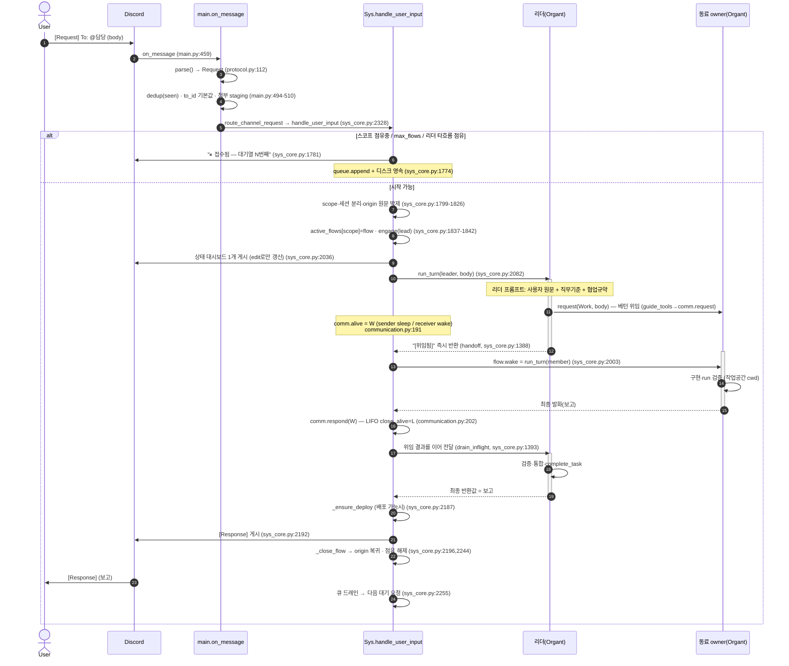
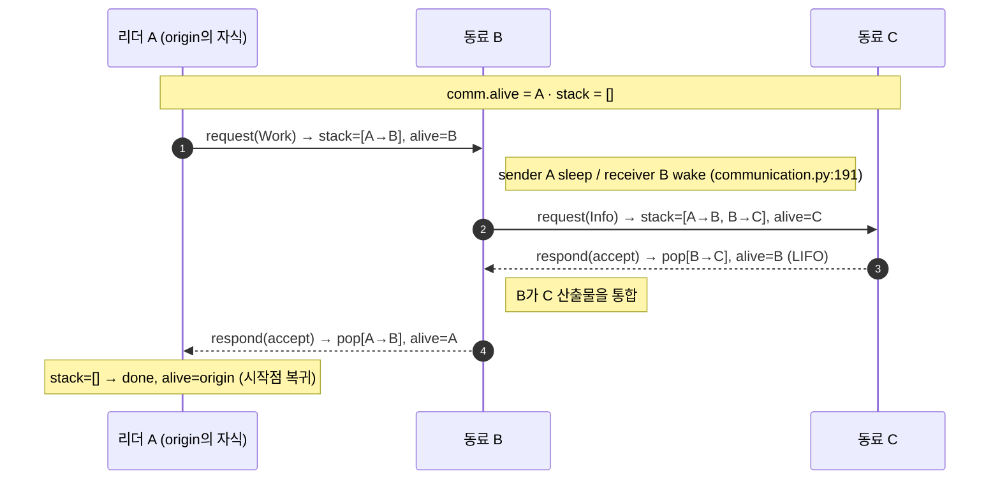
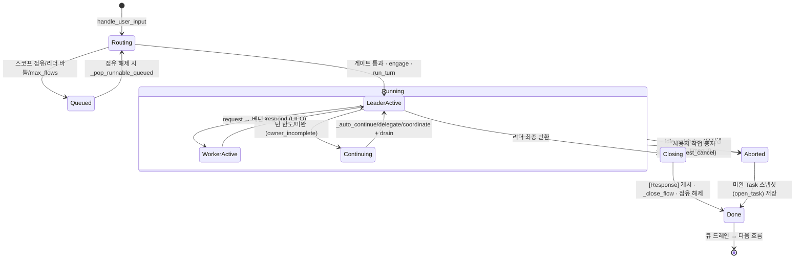
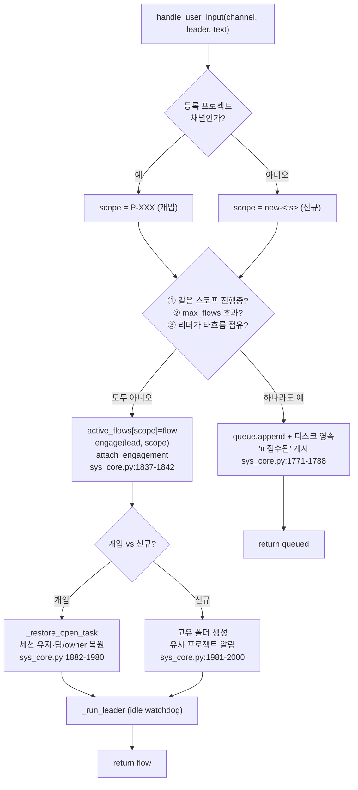
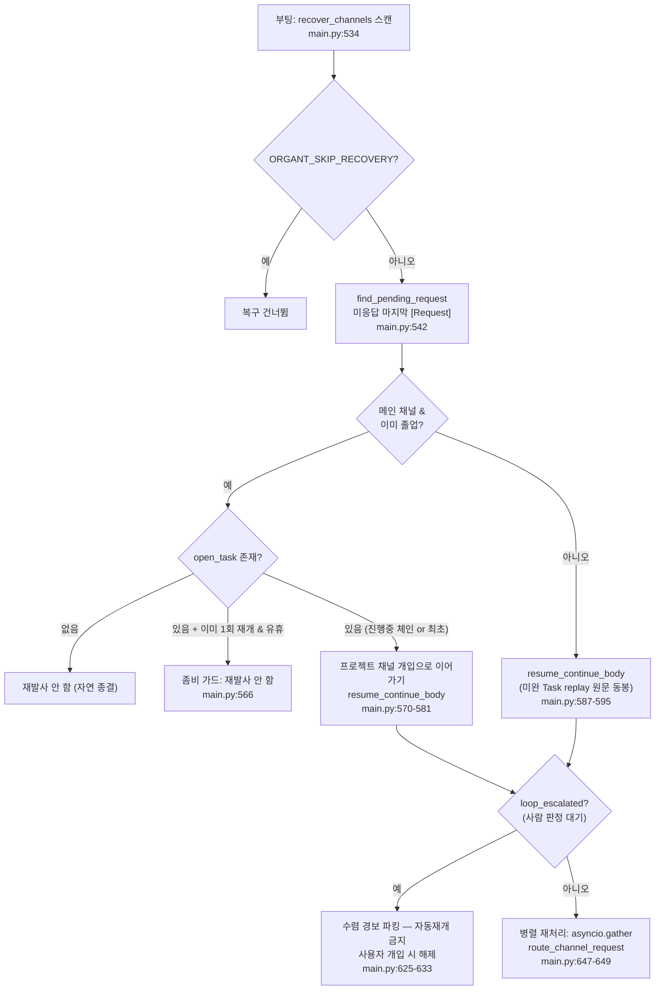

# 03 · 제어 흐름 — `[Request]` 생애주기와 베턴

이 문서는 시스템의 **심장**이다: 사용자 요청 하나가 어떻게 단일흐름 베턴을 타고 처리되어 보고로 돌아오는지, 그리고 그 과정의 불변식이 어디서 강제되는지를 추적한다.

## 3.1 전체 생애주기 (한눈에)

<!-- 소스: diagrams/03-lifecycle-sequence.mmd -->

> **읽는 법**: 1~5는 *수신·라우팅*(SYS의 얇은 부분), 6~끝은 *베턴 처리*(LLM이 일하는 부분). 위임이 여러 단계면 11~16이 중첩 베턴으로 깊어진다(아래 3.3).

## 3.2 베턴 — 단일 활성과 요청 스택

흐름 '안'의 핵심 규칙은 순수 로직 모듈 [`communication.py`](../../src/communication.py)의 `CommunicationManager`가 강제한다(네트워크 없음 = 단위 테스트 용이).

### 불변식과 강제 지점

| 불변식 | 의미 | 강제 위치 |
|--------|------|-----------|
| **단일 활성** | 활성 Organt은 항상 1명(`alive`). 활성만 request/respond 가능 | `communication.py:165-166`, `:200-201` |
| **LIFO close** | 응답은 스택 역순으로 닫힘 | `communication.py:202` (`_stack.pop()`) |
| **시작점 복귀** | 모든 프레임이 닫히면 흐름이 origin으로 복귀·종료 | `communication.py:209-211` |
| **busy-guard(흐름 내)** | 미완 Work 보유 동료에겐 Work 재요청 불가(겹침·순환 방지) | `communication.py:183-184` |
| **재진입 금지** | 내 응답을 기다리며 멈춘 상위 동료에겐 되물을 수 없음 | `communication.py:178-182` |
| **점유 배타성(흐름 간)** | 타 흐름이 점유한 봇에겐 Kind 불문 요청 불가 | `communication.py:171-177` |

### 베턴 핸드오프의 정밀 동작

<!-- 소스: diagrams/03-baton-stack.mmd -->

이 LIFO 사슬 덕분에 **각자 범위가 보존**된다: C는 C 일, B는 B의 통합(C 산출물), A는 A의 통합(B 산출물). 끊긴 체인을 *평탄화*(A→C 직접)하면 B를 빼먹어 C/리더가 B 일까지 떠안는 문제가 생기는데, 이를 막기 위해 `restore_chain`이 스택을 원형대로 복원하고 가장 깊은 워커부터 재개한다. `src/communication.py:329-349`, `src/sys_core.py:1410-1465`

### 베턴 외 특수 전이

| 도구/경로 | 동작 | 근거 |
|-----------|------|------|
| `redo` | 직전 응답 불만족 → 같은 owner 재요청(한도 `redo_limit=2`, 초과 시 상신) | `communication.py:256-266` |
| `escalate` | top 프레임 강제 close → 위로 상신(교착·죽은 Organt 방지) | `communication.py:268-283` |
| `report_up_to` | 상류 owner에게 선행작업 되감기(임의 깊이, 중간 동료는 relay만, 부분 되감기) | `communication.py:285-327` |
| `restore_chain` | 끊긴 체인을 채팅 재발행 없이 comm 스택으로 복원, 가장 깊은 워커부터 재개 | `communication.py:329-349` |

## 3.3 Flow 상태 머신

<!-- 소스: diagrams/03-flow-state.mmd -->

상태별 책임 요약:

- **Routing** — `handle_user_input`의 게이트(`sys_core.py:1757-1788`). 동시성 안전은 *게이트 검사~점유 등록까지 `await` 없음*으로 보장(asyncio 단일 스레드). `src/sys_core.py:1834-1842`
- **Continuing** — 턴 한도/무활동으로 끊긴 위임을 **SYS가 직접** 이어보낸다(리더 판단에 의존하지 않음): `_auto_continue_owner`(이미 위임된 미완), `_auto_delegate_owner`(위임 0건 헛돎), `_auto_coordinate`(막힌 교차도메인). `src/sys_core.py:1354-1538`, 호출은 `:2108-2115`
- **Aborted** — 두 종류: 무진행 워치독(`_await_with_idle_watchdog`, `sys_core.py:1156-1179`)과 사용자 중지(`request_cancel`, `:2279-2292`). 어느 쪽이든 미완 Task를 `open_task`로 스냅샷해 다음 개입에서 이어가게 한다.

## 3.4 라우팅 게이트 — 큐잉 결정

<!-- 소스: diagrams/03-routing-gate.mmd -->

> ③ "리더가 타 흐름 점유"가 핵심이다: 임의의 흐름 수 상한 대신 **한 봇은 한 번에 한 흐름**이라는 점유 배타성으로 병렬 안전을 보장한다 → 같은 리더의 프로젝트들은 자연히 직렬화된다. `src/sys_core.py:1769-1773`

## 3.5 부팅 복구 결정 흐름

리스너가 흐름 도중 죽어도(컨테이너 회수·크래시) 재시작 시 미응답 요청을 마저 처리한다. 이 결정은 **재발사 유령**(이미 졸업한 원요청을 새로 시작)과 **좀비 부활**(버려진 미완 프로젝트가 매 부팅 되살아남)을 막는 여러 가드로 둘러싸여 있다.

<!-- 소스: diagrams/03-boot-recovery.mmd -->

복구의 순수 판정 함수들(테스트 가능하게 분리):

- `find_pending_request` — 미응답 마지막 사용자 `[Request]` 찾기. `src/main.py:92-102`
- `graduated_project` — 원요청이 프로젝트로 졸업했는지. `src/main.py:105-115`
- `projects_to_resume` — open_task 남은 프로젝트(좀비 가드·파킹 적용). `src/main.py:118-152`
- `resume_continue_body` — 재발사 본문에 '이어가기·조기완료 금지·replay 원문'을 못박음. `src/main.py:155-175`

## 3.6 무진행 워치독 — "일하면 안 자른다"

고정 벽시계 타임아웃이 *오래 걸리는 정상 빌드*를 잘라 좀비·미완을 만들던 결함을 교정한 핵심 설계. 두 층의 워치독은 **무활동(idle) 기준**으로만 끊는다 — 도구 활동(`flow.last_activity`)이 한 번이라도 갱신되면 무한정 허용:

| 워치독 | 대상 | 기준 | 근거 |
|--------|------|------|------|
| `_run_until_silent` | 워커(비-리더) 턴 | `turn_timeout`(기본 480s) 동안 도구 활동 0 | `src/sys_core.py:1540-1570` |
| `_await_with_idle_watchdog` | 리더 턴(흐름 전체) | `idle_timeout`(기본 1200s) 동안 진행 0 | `src/sys_core.py:1156-1179` |

활동 신호는 도구 훅뿐 아니라 **메시지 수신·stderr 출력**으로도 갱신된다(레이트리밋으로 첫 토큰까지 침묵하는 턴을 '행'으로 오인하지 않게). `src/organt.py:200-235`

---

### 다음
- 이 흐름이 어떤 상태를 어떻게 영속·복원하는지 → [04 상태·영속·복구](04-state-persistence-recovery.md)
- 메시지 계약·권한·감사 → [05 권한·감사·통신 계약](05-permissions-audit-protocol.md)
