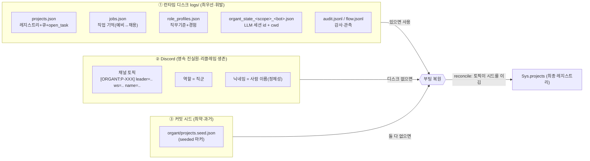
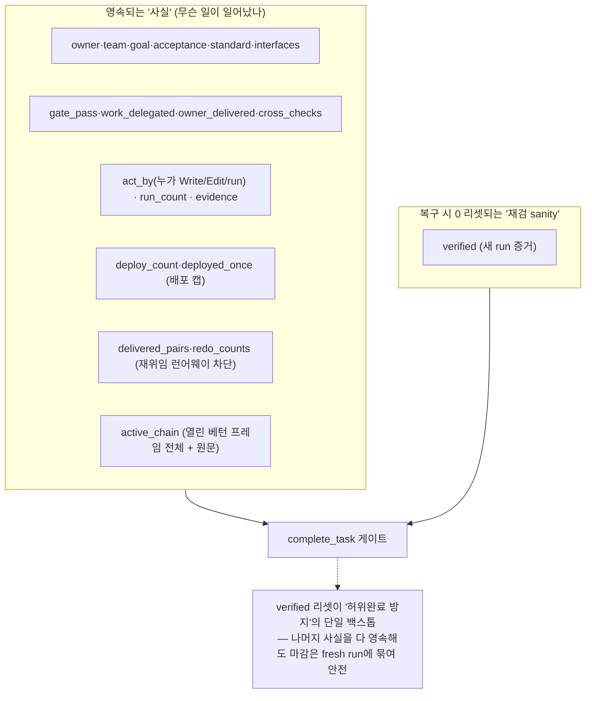

# 04 · 상태 · 영속 · 복구

> 이 시스템의 운영 가정은 **"컨테이너는 회수된다(reclaim)"**: 디스크(`logs/`)·`.env`는 언제든 사라질 수 있다. 따라서 모든 중요한 상태는 다중으로 영속·복원된다. 이 문서는 *무엇이 어디에 어떻게* 남는지를 정리한다.

## 4.1 영속의 3계층과 우선순위

```
런타임 디스크(logs/)  >  Discord(채널 토픽 · 역할 · 닉네임)  >  커밋된 시드(organt/projects.seed.json)
```

리클레임으로 디스크가 사라지면 Discord에서, Discord도 없으면 시드에서 복원한다. 시드는 *커밋 시점의 과거*라 가장 약한 진실원이며, 복원 시 `seeded` 마커를 남겨 부팅 reconcile에서 토픽이 이기게 한다. `src/sys_core.py:112-136`, `src/sys_core.py:320-365`

<!-- 소스: diagrams/04-persistence-tiers.mmd -->


### 원자적 쓰기

레지스트리·잡·프로필은 **임시파일 → flush → fsync → `os.replace`**로 저장한다. 쓰는 도중 죽어도 원본이 '반쪽 JSON'으로 깨지지 않는다. 임시파일명에 `monotonic_ns`를 붙여 병렬 흐름 동시 저장 경합을 피한다. `src/sys_core.py:148-155`

> 🏗️ **체계 관찰**: 같은 원자적-쓰기 패턴이 `_save_projects`/`_save_jobs`/`_save_profiles`에 3벌 복제돼 있다(`sys_core.py:138-157`, `:174-188`, `:771-782`). 단일 `atomic_write_json(path, data)` 헬퍼로 묶을 여지 → [06](06-patterns-conventions.md) 참조.

## 4.2 무엇이 어디에 영속되는가

| 상태 | 저장소 | 키 | 근거 |
|------|--------|-----|------|
| 프로젝트 레지스트리 | `projects.json` + 채널 토픽 | channel_id → {id, name, ws, leader, purpose, open_task, …} | `src/sys_core.py:195-269` |
| 대기열(queue) | `projects.json`(같은 파일) | `queue: [[ch, leader, text, root]]` | `src/sys_core.py:142-147` |
| 직업 기억(예비→채용 직군) | `jobs.json` + Discord 역할 | bot_id → 직군 | `src/sys_core.py:159-193`, `src/main.py:328-338` |
| 사람 이름(정체성) | Discord 닉네임 | bot_id → 이름 | `src/main.py:74-89`, `:345-360` |
| 직무 기준·경험(플라이휠) | `role_profiles.json` | 직군 → 기준/경험 | `src/sys_core.py:756-784` |
| LLM 세션(작업 기억) | `organt_state_<scope>_<bot>.json` | session_id + cwd | `src/organt.py:143-154` |
| 미완 Task(이어가기) | `projects.json`의 `open_task` | Task 스냅샷(아래 4.4) | `src/sys_core.py:393-482` |
| 사용자 취향(피드백) | `projects.json`의 `feedback` | [{ts, text}] (최근 50) | `src/sys_core.py:1688-1710` |

## 4.3 LLM 세션(작업 기억) 보존

각 Organt의 작업 맥락은 **세션 id**로 보존되며, 흐름 스코프별 파일로 분리된다(`organt_state_<scope>_<bot>.json`) — 프로젝트 간 기억 교차 오염이 *구조적으로* 불가능. `src/sys_core.py:240-242`, `src/sys_core.py:1795-1799`

핵심 안전장치:

- **`pinned_cwd`** — CLI 세션 저장소는 cwd 기준 슬러그라, 같은 세션을 resume하는 빌드는 *세션이 시작된 그 cwd*를 그대로 써야 찾는다. 흐름 도중 작업공간이 바뀌어도(`create_project` 카빙) 연속성이 유지된다. `src/organt.py:60-71`, `src/main.py:256-261`
- **스테일 세션 결정론 판정** — resume 대상이 *이 cwd의* 저장소에 실재하는지 파일 존재로 본다(에러 텍스트에 안 기댐). 없으면 새 세션으로 안전 저하 — `No conversation found` 영구 헛돌이 차단. `src/organt.py:165-178`, `:270-271`
- **일시 오류 재시도** — 429/5xx/529·서브프로세스 사망·**빈 응답('')**을 일시 오류로 보고 백오프 재시도(2s·4s). `src/organt.py:74-88`, `:273-292`

> ⚠️ **개선 관찰**: 일시 오류/스테일 세션 판정이 **문자열 부분일치**(`"no conversation found"`, `"429"`, `"stream closed"` 등)에 의존한다(`organt.py:54-57`, `:85-88`). CLI 메시지 문구 변화에 취약한 휴리스틱 — 에러 분류 체계(타입/코드)가 없는 자리. → [06](06-patterns-conventions.md).

## 4.4 Task 스냅샷 — "사실은 영속, 재검 sanity는 리셋"

흐름 '도중' Task 전이마다(`create_task`/`set_goal`/owner 확정/`complete_task`) 미완 Task를 레지스트리에 스냅샷한다(크래시-세이프). `_checkpoint_open_task`. `src/sys_core.py:553-567`

스냅샷의 원칙(`_task_snapshot`, `src/sys_core.py:393-482`):

<!-- 소스: diagrams/04-snapshot-split.mmd -->


이 설계의 동기는 라이브에서 **컨테이너 회수·재시작이 잦아** 인메모리 리셋이 복구마다 검증 핸드셰이크를 다시 요구해 마감이 영영 안 닫히던 결함이다. 작업공간 파일은 복구에 보존되므로 그 검증 사실의 영속은 유효하고, `verified`만 새 run 증거로 다시 채운다. `src/sys_core.py:393-401`, `:432-445`

> 🏗️ **체계 관찰**: 스냅샷은 **~30개 필드를 손으로 직렬화/역직렬화**한다(`_task_snapshot` ↔ `_restore_open_task`, `sys_core.py:402-482` ↔ `624-754`). 두 함수가 1:1로 짝을 이뤄야 하는데 그 대응이 코드로 강제되지 않는다(필드 추가 시 한쪽 누락 = 복구 결함 — 주석이 과거 누락 사고를 명시). dataclass + (de)serialize 단일화 후보 → [06](06-patterns-conventions.md), [07](07-refactoring-targets.md).

## 4.5 정밀 복구 — 깊은 위임 체인 보존

끊김 시 *레벨1 owner*만이 아니라 **가장 깊은 활성 워커**(체인 끝)를 그 원문으로 재개한다. `active_chain`(열린 베턴 프레임 전체 + 위임 원문)을 영속하고, 복구 시 `restore_chain`으로 comm 스택을 원형 복원한 뒤 깊은 워커부터 깨워 C→B→A로 자연 unwind한다(각자 범위 보존). `src/sys_core.py:697-727`, `:1410-1465`, `src/communication.py:329-349`

평탄화 폴백(리더→깊은워커 직접)은 *기본*이 아니라 정밀 경로 실패 시의 드문 안전망이다. `src/sys_core.py:1456-1463`

## 4.6 좀비 가드 · 수렴 파킹

부팅 복구가 **버려진 미완 프로젝트**를 매번 되살려 공유 전문가를 점유하고 새 요청을 굶기는 것을 막는다:

- **좀비 가드** — 같은 미완 Task를 이미 1회 자동 재개했는데 *유휴*(active_chain 없음)면 더는 자동 재개 안 함. 단 *진행 중 위임 체인*이 살아 있으면(컨테이너에 죽은 활성 작업) 가드 무시하고 재개. 사용자 활동(피드백) 시 `recovery_attempted` 해제로 재무장. `src/main.py:133-152`, `src/sys_core.py:1702-1704`
- **수렴 파킹** — 사람 판정 대기(`loop_escalated`) Task는 컨테이너 리클레임마다 워커를 다시 띄우지 않고 영속 파킹. 사람이 채널에 글을 쓰면(개입) 경보가 풀린다. 메모리 폭탄(OOM) 방지의 단일 차단 지점. `src/main.py:615-633`, `src/sys_core.py:1898-1918`

## 4.7 SIGTERM 우아한 종료

컨테이너 회수(~grace) 직전 SIGTERM/SIGINT 핸들러가 **모든 라이브 flow를 즉시 체크포인트**하고 `projects.json`을 flush한 뒤 종료한다 — 복구가 *최신* 상태에서 이어가게. flush는 동기·빠름(1회 쓰기). `src/main.py:395-423`

> ✅ **좋음**: 종전엔 SIGTERM 핸들러가 *전혀 없어* exit 143이 미체크포인트 상태를 통째로 잃었고 복구가 0에서 재구성하던 churn의 근원이었다. 종료 경로의 상태 flush는 리클레임 환경의 필수 안전망이다. `src/main.py:395-399`

## 4.8 게이트웨이 좀비 감지(카나리아)

RESUME 후 '프로세스는 살았는데 게이트웨이 수신만 죽는' 좀비 세션을 감지한다: 숨긴 채널의 **고정 앵커 메시지 1개를 주기적으로 edit**하고 그 `MESSAGE_UPDATE` 수신으로 생존 확인 — 채널에 메시지가 늘지 않는다. 2주기 연속 미수신이면 자가 재기동(`os._exit(43)` → 래퍼 부활 + 부팅 복구). 컨테이너 일시정지(벽시계 점프 3배+)도 같은 경로로 재기동. `src/main.py:433-451`, `:701-729`

---

### 다음
- 메시지 계약·권한 훅·감사 → [05 권한·감사·통신 계약](05-permissions-audit-protocol.md)
- 위 패턴들의 좋음/개선/체계필요 종합 → [06 패턴·컨벤션](06-patterns-conventions.md)
