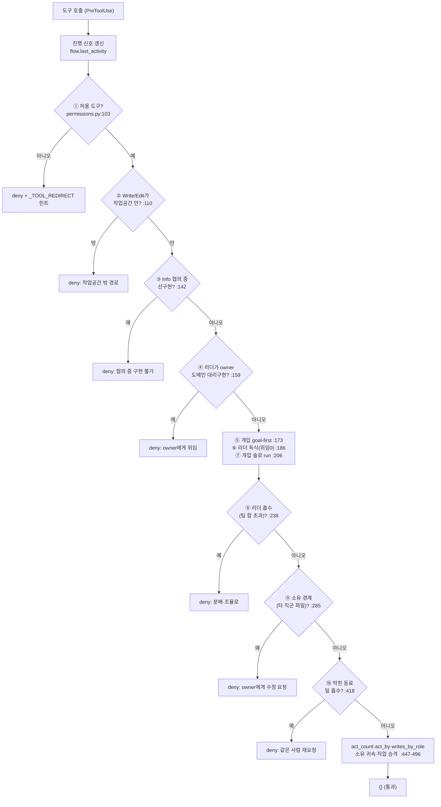

# 05 · 권한 · 감사 · 통신 계약

이 문서는 **경계(boundary)** 3종을 다룬다: ① Organt와 Discord 사이의 메시지 계약(`protocol`), ② Organt의 행동을 제한하는 권한 훅(`permissions`), ③ 모든 행동의 기록(`audit`).

## 5.1 통신 계약 — `protocol.py`

Discord엔 **구조화된 형식만** 오간다. Discord가 주는 정보(보낸 봇=From, reply=RepliesTo, 메시지 ID)는 블록에 쓰지 않고, 블록엔 Discord가 주지 않는 것만 적는다. 사람도 읽고 System 봇도 파싱한다. `src/protocol.py:1-11`

```
[Request]            [Response]          [Task-XXX]
To: @XXX             Body: ---           Purpose / Status / Goal / Owner / Group / (result)
Kind: Work|Info
Body: ---
```

| 타입 | 정의 | 근거 |
|------|------|------|
| `Kind` | `WORK`("Work") / `INFO`("Info") 문자열 enum | `src/protocol.py:17-19` |
| `Request` | to_id·kind·body(+from_id·message_id·attachments) | `src/protocol.py:22-30` |
| `Response` | body·replies_to(닫는 Request의 메시지 ID) | `src/protocol.py:33-39` |
| `TaskStatus` | task_id·purpose·status·goal·owner·group·result | `src/protocol.py:42-51` |

- **포맷팅(SYS→Discord)**: `format_request`/`format_response`/`format_task_status`. `src/protocol.py:56-78`
- **파싱(Discord→SYS)**: `parse()`가 헤더로 분기. `Body:` 멀티라인을 첫 줄에서 자르지 않게 `_multiline_body`가 따로 뽑는다(과거 버그 교정). `src/protocol.py:100-131`

> ✅ **좋음**: 메시지 계약이 단일 모듈에 dataclass로 응집돼 있고, 인코딩/파싱과 도메인 타입이 한 곳에 모여 있다. `Kind`가 `str, Enum`이라 문자열·enum 양쪽 비교가 자연스럽다. `src/protocol.py:17`

## 5.2 권한 훅 — `permissions.py`

Organt는 `claude-agent-sdk`의 `PreToolUse` 훅으로 통제된다. 봇은 Claude라 기본 CLI 도구(Bash·Agent·Task·TodoWrite 등)를 본능적으로 집는데, Organt는 게이트가 걸린 대체 도구만 노출하므로 — **거부에 "대신 이걸 써라"를 붙여** 즉시 올바른 도구로 유도한다(`_TOOL_REDIRECT`). `src/permissions.py:43-61`

> ✅ **좋음**: 라이브에서 'Bash 거부 163건의 74%가 run으로 복귀 못함'을 관측하고, 거부를 *redirect*로 바꿔 본능을 이기는 대신 받아넘긴다 — 프롬프트 강화보다 실효적. `src/permissions.py:43-48`

### 게이트 파이프라인 (단일 `make_pre_tool_use_hook`)

훅 하나가 **10개의 순차 게이트**를 통과시킨다. 통과해야만 `act_count`/소유 귀속이 집계된다.

<!-- 소스: diagrams/05-permission-gates.mmd -->


| # | 게이트 | 막는 것 | 근거 |
|---|--------|---------|------|
| 1 | 도구 허용 + redirect | 권한 밖 도구(Bash 등) | `:103-107` |
| 2 | 작업공간 confinement | cwd 밖 파일 쓰기 | `:110-116` |
| 2.5 | 쓰기 리스(휴면) | 병렬 가지 간 파일 충돌(현재 호출부 없음) | `:118-134` |
| 3 | Info 선구현 차단 | 협의 단계에서의 구현 | `:142-153` |
| 4 | owner 대리구현 차단 | 리더가 owner 도메인 직접 Write | `:159-169` |
| 5 | 개입 goal-first | Goal 확정 전 즉흥 수정 | `:173-180` |
| 6 | 리더 독식 차단 | 팀 있는데 위임 0 + 단독 구현 | `:186-199` |
| 7 | 개입 솔로 run | Task 없이/위임 0으로 run 반복 | `:206-229` |
| 8 | 리더 흡수 차단 | 리더 doing > 팀 합 | `:238-266` |
| 9 | 소유 경계 | 타 직군 소유(`file_owner`) 파일 편집 | `:285-305` |
| 10 | 막힘 흡수 차단 | 막힌 동료 일을 대신 구현 | `:418-443` |

### 설계 진화의 화석 — 키워드 분류 → 소유 기반

게이트 #9는 한때 파일 도메인을 **키워드/`_CAPS`/`_FILE_CAP_KW`로 추측**했으나(거짓양성: 프론트 `app.js`·QA 테스트 오판), *기록된 소유*(`file_owner`)로 강제하도록 교체됐다. 옛 키워드 버전은 `if False and …`로 비활성화된 채 **~100줄 데드코드로 남아 있다**. `src/permissions.py:307-409`

> ⚠️ **개선**: 비활성 게이트(`if False`)가 코드에 ~100줄 상주한다(`permissions.py:310-409`). 주석도 "데드코드는 후속 정리"라 명시 — 실제 청소가 안 된 자리. 의도(왜 폐기했나)는 git history/주석에 보존하고 본문에서 제거할 후보. → [07](07-refactoring-targets.md).

> 🏗️ **체계필요**: 권한 정책 전체가 **하나의 420줄 함수에 번호 주석으로 박힌 10개 분기**다(`permissions.py:90-498`). 게이트마다 우선순위·면제·교착방지·자가치유 로직이 중첩돼, 추가/수정 시 상호작용을 추적하기 어렵다. "규칙(rule) 레지스트리 + 명시적 우선순위" 같은 체계가 없는 자리. → [06](06-patterns-conventions.md).

> 🏗️ **체계필요**: 모든 게이트가 `getattr(flow, "...", default)`로 Flow의 옵셔널 속성을 방어적으로 읽는다(예: `:160`, `:191`, `:241`). `Flow`가 ~40개 옵셔널 필드를 가진 god-object이고 그 계약이 타입으로 표현되지 않아, 훅·SYS·guide_tools가 암묵 계약에 의존한다. → [06](06-patterns-conventions.md).

### 보안 자세 요약

- **샌드박싱**: Organt는 cwd(작업공간) 밖에 쓸 수 없다(`_within` realpath 검사). `:19-27`, `:110-116`
- **최소 도구**: `Bash`·`Agent`·`Web*`는 기본 차단 — 셸은 게이트 걸린 `run`(`mcp__guide__run`)으로만. `:50`, `organt_allowed_tools` `:9-16`
- **구조적 협업 강제**: '협의→합의→위임→구현' 순서, 독식·흡수·대리구현 차단이 *프롬프트가 아니라 훅*으로 강제된다.

## 5.3 감사 — `audit.py`

```
AuditLog.record(event, **fields) → append-only JSONL 한 줄
```

- 모든 흐름(수집·라우팅·툴 호출·거부·응답)이 `audit.jsonl`에 한 줄씩 남는다. `src/audit.py:17-22`
- `make_post_tool_use_hook`이 **모든 툴 호출**을 `tool_use` 이벤트로 기록(actor·role·tool·input). `src/audit.py:25-48`
- 두 훅(Pre/Post) 모두 `flow.last_activity`를 갱신해 무진행 워치독의 사각(긴 단일 run)을 메운다. `src/permissions.py:96-100`, `src/audit.py:35-39`
- SYS의 구조화 이벤트(`_log`)는 파일(`flow.jsonl`) + **journald(stderr)** 양쪽으로 흘러 `journalctl`로도 사후 추적 가능. `src/sys_core.py:786-801`

> ✅ **좋음**: 감사 기록이 단순·append-only이고, 행위자 귀속(actor/role)이 일관돼 협업 관찰성이 좋다. `file_owner` 시딩이 이 audit 이력의 *최초 작성자*를 근거로 삼는 등(`sys_core.py:582-622`), 감사 로그가 단순 기록을 넘어 시스템 입력으로 재사용된다.

---

### 다음
- 위 관찰들을 포함한 전체 평가 → [06 패턴·컨벤션](06-patterns-conventions.md)
- 모든 근거의 file:line 색인 → [ref/REFERENCES.md](ref/REFERENCES.md)
