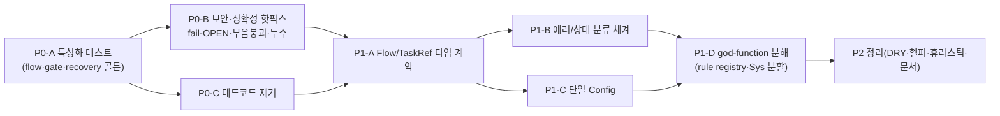

# 07 · 리팩토링 타깃 — 우선순위 백로그

[06 평가](06-patterns-conventions.md)를 실행 가능한 백로그로 정리한다. 우선순위는 **(이득 ÷ 노력) × 위험 감소**로 매겼다. 노력: S(작음)/M(중간)/L(큼).

> **대원칙(선후행)**: 이 코드는 수많은 라이브 인시던트 교정이 *미묘한 동작*으로 누적돼 있다(주석이 그 증거). **god-object/함수를 쪼개기 전에 특성화 테스트(characterization test)를 먼저** 깔아야 한다 — 안 그러면 "왜 그렇게 짰는지" 모르는 동작을 회귀로 잃는다. 아래 로드맵은 이 순서를 강제한다.

## 7.1 로드맵 (선후행)

<!-- 소스: diagrams/07-refactor-roadmap.mmd -->

## 7.2 P0 — 먼저 (위험 감소 · 작은 노력)

### P0-A · 특성화 테스트 골든 〔effort M〕
- **문제**: spine 동작이 테스트로 고정돼 있지 않은 영역(완료 게이트·정밀 복구·자동 이어가기/위임/조율)이 리팩토링 회귀에 무방비. deploy는 *전용 테스트가 없다*. `deploy.py:194`
- **방향**: `complete_task` 게이트 통과/거부, `_task_snapshot↔_restore_open_task` 라운드트립, 부팅 복구 결정(졸업·좀비·파킹), 베턴 LIFO/escalate/report_up_to의 **골든 테스트**를 먼저 작성. 기존 `tests/test_sys.py`(5366줄)에 의존하기 전 *작은 단위*로 분리.
- **영향**: `tests/`, (간접) `sys_core`·`guide_tools`·`communication`
- **위험**: 낮음(테스트 추가) · **이득**: 이후 모든 P1을 안전하게 만듦

### P0-B · 보안·정확성 핫픽스 〔effort S~M〕
| 항목 | 문제 | 방향 | 근거 |
|------|------|------|------|
| getattr fail-OPEN | 권한 게이트가 `getattr(flow,…,None)` → 필드 rename 시 조용히 *통과* | 게이트 입력을 명시 계약으로(또는 누락 시 fail-CLOSED) | `permissions.py:160` |
| orphan-reaper 무음 붕괴 | Render 고아 수거 가드가 읽기 실패 시 무너져 엉뚱한 서비스 수거 위험 | 읽기 실패 시 *수거 중단*(보수적 폴백) + 로깅 | `deploy.py:153` |
| PAT 유출 | 토큰 박힌 remote URL이 에러 문자열에 실릴 수 있음 | 에러 메시지에서 자격증명 마스킹 | `deploy.py:280` |
| 감사에 파일 내용 | PostToolUse가 `tool_input`(파일 내용) 전체 기록 | 경로·크기만 기록(내용 제외) 또는 트렁케이트 | `audit.py:45` |
| run 미-confinement | 작업공간 경계가 Write/Edit만 | run 경로도 경계/강등 일관 적용 검토 | `permissions.py:110` |

- **위험**: 낮음(국소 변경) · **이득**: 보안·운영 안전 직결

### P0-C · 데드코드 제거 〔effort S〕
- **문제**: 비활성 게이트 ~100줄(`permissions.py:310`), 데드·다이버전트 `organt_allowed_tools`(`:9`), 오해를 주는 `build_options` 기본값(`organt.py:109`), 고아 `channels.py`(`:40`).
- **방향**: 의도는 git history/주석에 남기고 본문 제거. `channels.py`는 `choose_text_channel_id`를 실제 사용처에 연결하거나 삭제 결정.
- **위험**: 낮음 · **이득**: 이후 리팩토링의 인지 부하·오독 감소

## 7.3 P1 — 구조 (높은 이득 · 중간~큰 노력)

### P1-A · `Flow`/`TaskRef` 타입 계약 〔effort L〕
- **문제**: 덕타이핑 god-object — SYS 주입 콜러블 + ~40 옵셔널 필드를 `getattr`로 방어적 접근. rename·오타가 런타임/무음 실패로. `guide_tools.py:590`·`:541`·`:619`, `sys_core.py:1874-1880`
- **방향**: ① `Flow`/`TaskRef`를 명시 dataclass로 정형화(필드·타입 선언), ② SYS 주입 콜러블을 `Protocol` 포트(예: `WakePort`·`PersistPort`)로 인터페이스화, ③ `getattr` 방어 접근 제거. **P0-A 테스트 위에서** 점진 적용.
- **영향**: `guide_tools`·`sys_core`·`permissions` · **이득**: 거의 모든 다른 항목의 안전성 기반(S1) · **위험**: 중(광범위 접점 — 테스트 선행 필수)

### P1-B · 에러/상태 분류 체계 〔effort M〕
- **문제**: 일시/스테일 에러(`organt.py:85`)·deny 사유(`permissions.py:105`)·deploy 결과(`deploy.py:236`)·상태/결과 어휘(`communication.py:205`, `guide_tools.py:1697`)·Kind 파싱(`:809`/`protocol:126`/`permissions:40`)가 모두 매직 문자열.
- **방향**: 에러를 **예외 타입**으로, 상태/결과/Kind/deny-사유를 **enum**으로 승격. `deploy.py:191`의 비-일시 에러 분류를 패턴으로 일반화. Kind 파싱 단일 함수화(`protocol`의 silent-INFO 기본 교정).
- **영향**: `organt`·`permissions`·`deploy`·`communication`·`protocol`·`guide_tools` · **이득**: 분기·로깅·테스트 견고화(B3·B8·S2) · **위험**: 중

### P1-C · 단일 `Config` 〔effort M〕
- **문제**: ~15개 `ORGANT_*` 노브가 모듈 곳곳에서 ad-hoc하게 읽힘; frozen `Config`가 진실원이 아님(`deploy.py:23`).
- **방향**: 모든 튜닝 노브를 `Config`로 모으고 1곳에서 파싱·검증·문서화(`config.py:10` 확장). env 직접 읽기 제거.
- **영향**: `config`·`sys_core`·`main`·`organt`·`guide_tools`·`deploy` · **이득**: 운영 가시성·테스트성(S5) · **위험**: 낮~중

### P1-D · god-function 분해 + 권한 rule registry 〔effort L〕
- **문제**: `make_guide_tools`(~2200)·`request()`(~590)·`run()`(~480)·PreToolUse 훅(~410, 10분기)·`Sys`(2334)·`deploy_sync`(~120).
- **방향**:
  - 권한 훅 → **규칙 객체 + 명시적 우선순위 레지스트리**(게이트별 단위 테스트). `permissions.py:90` (S3)
  - `make_guide_tools` → 도구별 모듈/팩토리로 분리, `request()` 핸들러 분해. `guide_tools.py:791`·`:805`
  - `Sys` → 협력자 분리(Router · FlowLifecycle · Persistence · Recovery · DeployCoordinator). `sys_core.py:37`
  - `run()` → 부트스트랩 단계별 함수(connect · identity · recovery · background loops). `main.py:282`
- **영향**: 핵심 2개 모듈 + 진입점 · **이득**: 변경·리뷰 단위 축소(B1) · **위험**: 높음 → **P0-A·P1-A 완료 후에만**

### P1-E · 완료-게이트 상태 단일화 〔effort M〕
- **문제**: ~30 필드 수동 직렬화/역직렬화(`sys_core.py:393↔624`), 두 함수 1:1 대응 미강제; 게이트 상태 이중 메커니즘(`_gate_pass` 집합 + boolean, `guide_tools.py:2080`).
- **방향**: 게이트 상태를 단일 dataclass로, (de)serialize 자동화(필드 추가 시 양쪽 자동 반영). 이중 메커니즘 통합.
- **영향**: `sys_core`·`guide_tools` · **이득**: 복구 결함의 구조적 차단(S4) · **위험**: 중(P0-A 테스트 필수)

## 7.4 P2 — 정리 (낮은 긴급도)

| 항목 | 방향 | 근거 |
|------|------|------|
| DRY: 좀비/파킹 가드 3중복 | 단일 헬퍼(복구 판정) | `main.py:566`·`:149` |
| DRY: 원자적-쓰기 3벌 | `atomic_write_json(path,data)` 헬퍼 | `sys_core.py:148`·`:181`·`:775` |
| 공유 헬퍼 집 없음 | `_jobs_of`/`_norm_job`/`_speech_clip`/`_CAPS`를 공용 유틸 모듈로(순환의존 해소) | `permissions.py:294`, `sys_core.py:593` |
| 도메인 휴리스틱 무검증 | 도메인 모델 + 테스트(`_CAPS`·`_FILE_CAP_KW`·직군 파싱) | `guide_tools.py:306`, `permissions.py:69` |
| 침묵 실패 관측 신호 | `except Exception: pass`에 최소 로깅(삼키되 신호는 남김) | `guide_tools.py:1475`, `main.py:359` |
| 문서 정합 | 스테일 docstring 참조 정리, README↔코드 불일치 교정(§6.5) | `communication.py:3` 등 |
| `·` 직군 구분자 결합 | 단일 상수/파서로 | `discord_guide.py:320` |

## 7.5 요약 표 (우선순위 × 노력 × 이득)

| ID | 항목 | 우선 | 노력 | 이득 | 위험 |
|----|------|:----:|:----:|------|:----:|
| P0-A | 특성화 테스트 골든 | P0 | M | 이후 전부의 안전성 | 낮 |
| P0-B | 보안·정확성 핫픽스 | P0 | S~M | 보안·운영 안전 | 낮 |
| P0-C | 데드코드 제거 | P0 | S | 인지부하↓ | 낮 |
| P1-A | Flow/TaskRef 타입 계약 | P1 | L | 구조 안전 기반 | 중 |
| P1-B | 에러/상태 분류 체계 | P1 | M | 견고한 분기·로깅 | 중 |
| P1-C | 단일 Config | P1 | M | 운영 가시성 | 낮~중 |
| P1-D | god-function 분해·rule registry | P1 | L | 변경 단위↓ | 높 |
| P1-E | 완료-게이트 상태 단일화 | P1 | M | 복구 결함 차단 | 중 |
| P2 | DRY·헬퍼·휴리스틱·문서 정리 | P2 | S~M | 유지보수성 | 낮 |

---

### 다음
- 각 항목의 근거 file:line → [ref/REFERENCES.md](ref/REFERENCES.md)
- 평가 원본 → [06 패턴·컨벤션](06-patterns-conventions.md)
