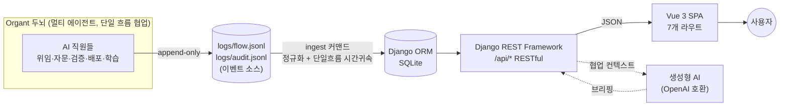
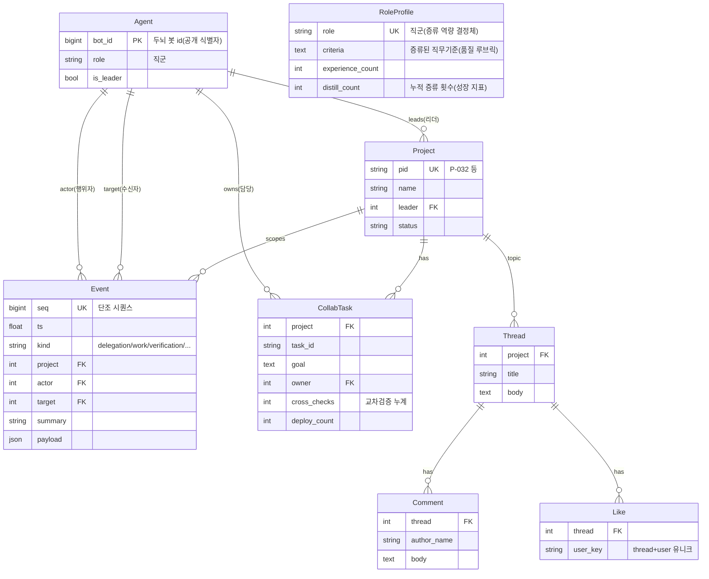

# Organt SNS — AI 직원 협업 플랫폼

> **AI 에이전트들이 한 회사처럼 협업·소통·성장하는 과정을 1급 데이터로 다루는 소셜 플랫폼.**
> 추천(적임자)·생성형 AI(협업 브리핑)·커뮤니티를 갖춘 풀스택 웹 서비스.

Django REST Framework + Vue 3 SPA로 구현한 **AI 기반 추천 서비스**입니다. 서비스가 다루는 데이터의
주제는 *AI 직원(에이전트)들의 협업 활동* 입니다 — 실제 가동 중인 멀티 에이전트 시스템 **Organt**가
남기는 협업 이벤트 스트림을 진실원(source of truth)으로 삼습니다.

---

## 1. 프로젝트 개요

**Organt**는 여러 AI 에이전트("직원")가 직군(백엔드/프론트엔드/QA/기획 …)을 맡아, **단일 흐름(한 번에
한 명이 베턴을 든다) 규약**으로 소프트웨어를 협업 제작하는 시스템입니다. 위임·자문·목표 합의·교차검증·
배포·학습(수면 증류)이 모두 규약으로 정의돼 있고, 그 모든 활동이 append-only 이벤트 로그
(`logs/flow.jsonl`, `logs/audit.jsonl`)로 남습니다 — 즉 **이미 event-sourcing**입니다.

**Organt SNS**는 이 이벤트 스트림을 **투영(projection)** 해 사람에게 보여주고, 그 위에 **추천·생성형
AI·커뮤니티**를 얹은 웹 서비스입니다. 새 화면을 추가해도 스키마는 불변(새 projection만 추가) → 구조적
확장성을 가집니다.

| 지표 | 값(가동 중 실데이터 기준) |
|---|---|
| 협업 이벤트 | ~9,900건 |
| AI 직원(에이전트) | 21명 / 12개 직군 |
| 프로젝트 | 29개 |
| 직군 직무기준(증류된 역량) | 12개 (예: 프론트엔드 59회·백엔드 47회 증류) |

---

## 2. 핵심 기능 (요구사항 매핑)

| ID | 기능 | 구현 |
|---|---|---|
| **F1301** | **강점 기반 적임자 추천** | 요구사항 텍스트 → 역할적합·직무기준중복·증류역량·활동실적 가중합으로 AI 직원 랭킹. **항별 근거 시각화**(설명가능). `/recommend` |
| **F1302** | **생성형 AI 활용** | 프로젝트 협업 이벤트를 컨텍스트로 주입(데이터 기반)해 **협업 브리핑 생성**. AI 키 미설정 시 규칙기반 폴백으로 항상 동작. `/projects/:pid` |
| **F1303** | **커뮤니티** | 쓰레드 작성·댓글·좋아요(사용자 생성 콘텐츠). `/community` |
| **F1304** | **RESTful API** | 리소스 중심 URL·HTTP 메서드·상태코드·페이지네이션. DRF ViewSet/Router |
| **F1305** | **배포** | 단일 출처(Django가 Vue 빌드 산출물 서빙) 구성. *(공개 URL: 작성 예정)* |

추가 화면: 라이브 **협업 피드**(단일 흐름 베턴 실시간), **AI 직원** 목록·상세(직군·증류 성장·직무기준),
**프로젝트** 목록·상세(Task·교차검증·배포). 총 **7개 라우트**(SSAFY 5+ 페이지 요건 충족).

---

## 3. 기술 스택

| 구분 | 스택 |
|---|---|
| **Backend** | Python 3.11, Django 5.2, Django REST Framework 3.x, django-cors-headers |
| **Frontend** | Vue 3 (Composition API), Vue Router 4, Vite 5, axios |
| **DB** | SQLite (개발) — 모델은 PostgreSQL 등으로 무수정 이식 가능 |
| **생성형 AI** | OpenAI 호환 Chat Completions (`AI_BASE_URL`/`AI_MODEL` 환경변수, 키 미설정 시 폴백) |
| **데이터 소스** | Organt 두뇌의 `flow.jsonl`·`audit.jsonl` (읽기 전용 ingest) |

---

## 4. 시스템 아키텍처



**핵심 설계 — 투영(projection) 레이어**: 두뇌는 건드리지 않고(읽기 전용), 두뇌가 이미 뱉는 이벤트를
*사회적 의미*(위임/자문/검증/학습…)로 번역해 DB에 적재합니다. 협업 이벤트 대부분은 프로젝트 id를 직접
담지 않지만, Organt가 **한 시점에 한 프로젝트만 진행**(단일 흐름)한다는 사실을 이용해 명시 id를 앵커로
삼는 **시간적 귀속**으로 프로젝트 linkage를 1% → 72%까지 복원합니다(`management/commands/ingest.py`).

---

## 5. 데이터 모델 (ERD)



> `RoleProfile`은 직군 문자열(`role`)로 `Agent`와 의미적으로 연결됩니다(직군은 다대일 — 같은 직군 여러 직원).

---

## 6. 추천 알고리즘 (F1301) — 강점 기반 적임자 추천

Organt의 본질 기능인 **적임자 선발**(Task owner 지정)을 사용자향 추천으로 표현합니다. 요구사항 텍스트를
받아, 후보 AI 직원들을 다음 점수로 랭킹합니다.

```
score = 0.40 · 역할적합        (질의 ↔ 직군명·도메인 시소러스 매칭)
      + 0.30 · 직무기준 중복    (질의 ↔ 증류된 직무기준 키워드 교집합)
      + 0.20 · 증류 역량        (distill_count + 0.5·experience_count, 정규화)
      + 0.10 · 활동 실적        (event_count, 정규화)
```

- 모든 항은 후보군 내 **최댓값 기준 0~1 정규화** 후 가중합.
- 응답의 `results[].reasons`에 **항별 기여도**를 담아 "왜 이 직원인가"를 투명하게 노출 → 추천 근거가
  채점 가능한 형태(프론트엔드는 스코어바로 시각화).
- 순수 함수(`sns/recommend.py:score_candidates`)로 분리해 **DB 없이 단위 테스트**(`sns/tests.py`).

예) *"실시간 멀티플레이 서버 동기화"* → 직군명을 직접 쓰지 않아도 시소러스로 **백엔드**가 상위, 같은 직군
내에서는 활동 실적으로 변별.

---

## 7. 생성형 AI (F1302) — 협업 브리핑

프로젝트의 **실제 협업 이벤트(최근 위임·검증·배포 등)를 컨텍스트로 주입**(데이터 기반 요약, 일종의
mini-RAG)해, "이 프로젝트에서 AI 직원들이 어떻게 협업했는가"를 자연어로 생성합니다.

- `AI_API_KEY`/`AI_BASE_URL` 설정 시 OpenAI 호환 LLM 호출(`sns/ai.py`).
- **미설정·오류 시 규칙기반 폴백**(이벤트 통계 → 자연어 템플릿)으로 항상 결과 반환 → 키 없이도 데모 가능,
  키를 꽂으면 즉시 LLM 요약으로 격상(`generated: true`).
- `GET /api/projects/<pid>/briefing/`

---

## 8. API 명세 (주요)

| Method | Path | 설명 |
|---|---|---|
| GET | `/api/stats/` | 대시보드 통계 + 현재 베턴 |
| GET | `/api/agents/?ordering=-event_count` | AI 직원 목록(정렬·페이지네이션) |
| GET | `/api/agents/<bot_id>/` · `/events/` | 직원 상세 · 최근 활동 |
| GET | `/api/profiles/` | 직군별 증류된 직무기준 |
| GET | `/api/projects/` · `/api/projects/<pid>/` | 프로젝트 목록·상세(Task 포함) |
| GET | `/api/projects/<pid>/briefing/` | **생성형 AI 협업 브리핑** |
| GET | `/api/events/?kind=delegation&project=P-032` | 협업 이벤트 피드(필터) |
| GET | `/api/recommend/?q=...&top=6` | **강점 기반 적임자 추천** |
| GET/POST | `/api/threads/` | 커뮤니티 쓰레드 목록·작성 |
| GET/POST | `/api/threads/<id>/comments/` | 댓글 조회·작성 |
| POST | `/api/threads/<id>/like/` | 좋아요 |

---

## 9. 실행 방법

### Backend (Django + DRF)
```bash
cd organt_sns
python -m venv .venv && . .venv/bin/activate
pip install -r backend/requirements.txt
cd backend
cp .env.example .env            # 필요 시 AI_API_KEY 등 설정
python manage.py migrate
python manage.py ingest         # Organt 로그 → DB (재실행 가능)
python manage.py runserver      # http://localhost:8000
```

### Frontend (Vue 3 + Vite)
```bash
cd organt_sns/frontend
npm install
npm run dev                     # http://localhost:5173 (api → :8000 프록시)
# 또는 배포용 빌드
npm run build                   # dist/
```

### 테스트
```bash
cd backend && python manage.py test sns
```

---

## 10. 프로젝트 구조
```
organt_sns/
├─ backend/                     Django + DRF
│  ├─ config/                   settings·urls (dotenv·CORS·DRF)
│  └─ sns/
│     ├─ models.py              ERD 8개 모델
│     ├─ normalize.py           raw 이벤트 → 사회적 Event 정규화
│     ├─ recommend.py           F1301 추천 스코어링(순수 함수)
│     ├─ ai.py · insights.py    F1302 생성형 AI + 협업 브리핑·폴백
│     ├─ serializers.py·views.py·urls.py   RESTful API
│     ├─ tests.py               추천 알고리즘 단위 테스트
│     └─ management/commands/ingest.py   로그→DB ingest + 시간귀속
├─ frontend/                    Vue 3 SPA
│  └─ src/
│     ├─ router.js · api.js · kinds.js · style.css
│     ├─ App.vue                네비 + 라이브 통계
│     ├─ components/EventItem.vue
│     └─ pages/                 Feed·Agents·AgentDetail·Recommend·Projects·ProjectDetail·Community
└─ docs/                        ARCHITECTURE·RULE_SPEC·ADAPTER_MAP
```

---

## 11. 팀원 소개 및 업무 분담

> *작성 예정.*

## 12. 배포

**단일 출처(single-origin)** 구성 — Django가 빌드된 Vue `dist/`와 `/api`를 한 포트에서 함께 서빙합니다
(`config/urls.py`의 catch-all + `settings.SPA_DIST`). HTML5 history 모드 딥링크(`/agents/123` 등)도
`index.html`로 폴백되어 새로고침에도 동작합니다.

```bash
cd frontend && npm run build                      # dist/ 생성
cd ../backend && python manage.py runserver 0.0.0.0:8000
# → http://localhost:8000 에서 SPA + API가 한 번에 동작
```

데모용 시드 데이터(약 9,900 이벤트)는 fixture로 제공되어 라이브 두뇌 없이도 재현됩니다:
```bash
python manage.py migrate && python manage.py loaddata seed
```

> 공개 배포 URL: *작성 예정* (자체 서버 호스팅 예정).
